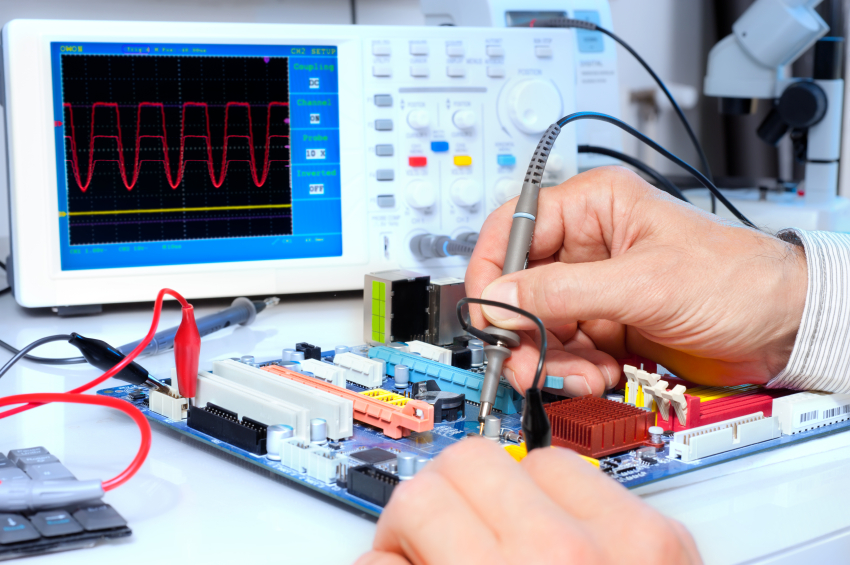

# О себе:
1. Меня зовут Владимир и мне 31 год.
2. Я работаю инженером-электронщиком и занимаюсь ремонтом и разработкой электроники для гражданской авиации.
3. 
4. Всегда было интересно программирование и вот наконец-то решился идти к своей мечте начав свой путь с тестирования.
